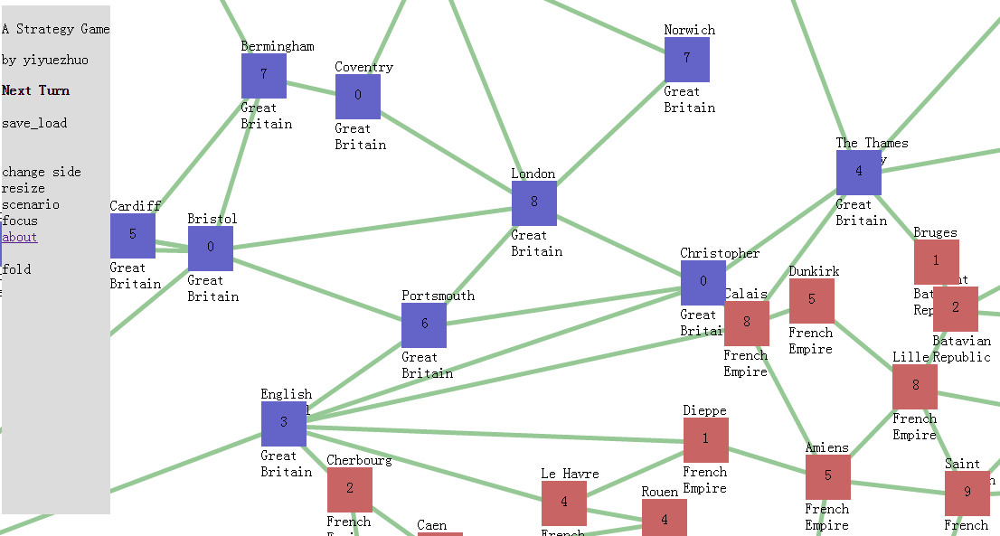

# sengokushi-port-javascript
Sengokushi(戦国史) is a great Historical Simulation Game in PC. This goal of the project is port it to web browser.

<a href='http://yiyuezhuo.github.io/games/sengokushi/project3/laucher.html'>Online game(GitHub page)</a>

If you click above link,you will enter a scenario launcher to select a js scenario to start game.

Notice, left toolbox text can click to activate something even it looks it's pure text.

## snr_parser.py 

Sengokushi scenario file (`*.snr`) parser written in Python.

### Usage

transform a `*.snr` file to `*.js` file

	$ python snr_picker.py trans scenario.snr obj.js

## ch_to_english.py

For some reason, I only can get Chinese or Japanese `*.snr` file. So I write parser face on chinese to point to point map,
but I also write the auto-translate script to translate Chinese text in scenario to English.It use baidu translate service,
it's machine translate so you will find even "jiataiji" on "Carthage".  

### Usage

translate a single `*.js` file to `*.js` file

	python ch_to_english.py input.js output.js
	
translate all `*.js` file in a path

	python ch_to_english.py -a project3/scenario
	
## Project1

Project1 is my first JavaScript project, I even don't know forEach beforn writing it. So the code is ugly and I can't tolerate
finally and to start to develop Project3.

However Project1 is come close to Sengokushi,it is leader-based. You controll some leader,who have some attribute,include 
infantry,cavalry,leadership etc.

## Project3

Project3 is RISK-style game. 

## Scenario List

You can get so many scenario that are include many style and age,as Star war,Khan,Roma,Napolean,the cival war,WI,WII,etc...

This repo have these scenario:

* `Europe1805` its source is a WI scenario,I changed to it.
* `fantasy` a small scenario to test this project.
* `guanfang` Sengokushi office scenario
* `guanyuan` a battle in Japanese in 1600
* `micro` a test scenario
* `MiniWorldWar2` as the name
* `moshou` a Warcraft III scenario
* `Roma` a Roma scenario
* `zhanguoce` a old China period scenario 
